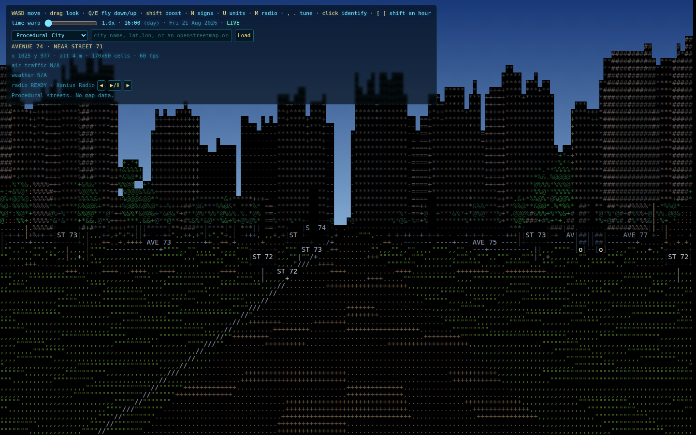

# ASCII City 2



Walk or fly through a living ASCII city in your browser. Load real streets and
buildings from OpenStreetMap or explore the deterministic procedural skyline.

This is a separate revision of [the original ASCII City](https://github.com/tweakyourpc/ascii-city),
with its own history and repository.

## What is new

- Cars follow a directed street graph, choose random routes, keep their lane,
  maintain headway, and brake for signals instead of bouncing between raster cells.
- Street signs face approaching traffic and name the cross street, not the street
  the viewer is already traveling on.
- Real cities use OpenStreetMap `highway=traffic_signals` nodes. Procedural cities
  use a repeatable subset of intersections. Opposing approaches have coordinated
  green, amber, and all-red clearance phases.
- Nearby internet radio comes from the open [Radio Browser](https://www.radio-browser.info/)
  directory, with play/pause and station tuning in the HUD.
- The city clock uses its real IANA time zone and daylight-saving rules. Time
  shifts become explicit simulations, while `NOW` returns to live conditions.
- Live ADS-B aircraft include nearest-contact bearing, distance, altitude, and
  turn guidance in the HUD, plus readable labels in the scene.
- Live earthquakes (USGS) mark recent seismic activity on the ground, colored by
  magnitude and recency, with a click-to-identify card.
- Live ALPR / "flock" camera map (DeFlock) shows license-plate readers near you
  as ground marks, colored by manufacturer (Flock amber, Motorola blue).
- Weather, rain, snow, astronomy, buildings, labels, and aircraft remain available.

## Run locally

ASCII City uses conventional Node tooling and binds to the LAN. With no `PORT`
set, the operating system selects an available port and the server prints it:

```bash
npm install
npm start
```

`GET /whoami` reports the running service identity and selected port.

### Optional Worker features

A clean clone contains no inherited Worker URL and sends no traffic through the
original author's accounts. Weather, OSM, geocoding, Wikipedia, astronomy, and
the procedural city work without a Worker. Live aircraft, live ALPR cameras, and
nearby-radio discovery report `SETUP REQUIRED` until the person deploying the
fork opts in.

To enable those features, deploy the included Worker from your own Cloudflare
account and put its URL in `ascii-city.config.js`:

```bash
npm run worker:deploy
```

```js
export default Object.freeze({
  workerUrl: 'https://your-worker.example',
});
```

## Controls

| Key | Action |
| --- | --- |
| `W` `A` `S` `D` / arrows | Move and turn |
| Drag | Look around |
| `E` / `Q` | Fly up / down |
| `Shift` | Boost |
| `N` | Toggle street signs |
| `B` | Cycle ASCII, block, and cinematic rendering |
| `L` | Cycle labels |
| `G` | Cycle traffic |
| `H` | Toggle traffic lights |
| `T` | Toggle live aircraft |
| `K` | Toggle live earthquakes |
| `F` | Toggle live ALPR cameras |
| `Y` | Toggle weather |
| `M` | Play/pause local radio |
| `,` / `.` | Previous / next station |
| `[` / `]` | Shift one hour |
| `0` | Return to the real current time at 1x |
| Click | Identify an object |

The HUD is docked on the left by default so it does not cover the city. Use
`A−` / `A+` to resize it independently of browser zoom, `FLOAT` to overlay it,
or drag the `ASCII CITY HUD` handle to place it anywhere. `QUALITY` cycles
cinematic rendering between adaptive and fixed scales. The layout is saved
locally in the browser.

### Vehicle showcase controls

Traffic uses stable vehicle profiles and distance-based pseudo-volume in every
rendering mode. Developer-only seed, density, and forced-LOD controls are
documented in [docs/engine-next/VEHICLES.md](docs/engine-next/VEHICLES.md); they
do not add controls to the normal HUD.

## Architecture

The browser app is static and has no runtime package dependencies. An optional,
deployment-owned Cloudflare Worker in `worker/src/index.js` supplies CORS-safe,
allowlisted endpoints for nearby aircraft and radio discovery. It also implements
`GET /whoami`.

OpenStreetMap connectivity is based on shared node IDs. Geometric crossings at
different nodes, such as bridges and tunnels, are deliberately not connected.
One-way and access restrictions are preserved in the directed graph.

## Quality checks

```bash
npm run check
workspace-quality-gate
```

The test suite is hermetic. Network integrations use injected fixtures in tests.

## Data and licensing

- Map data: OpenStreetMap contributors, ODbL.
- Aircraft: adsb.lol, ODbL; coverage may be delayed or incomplete.
- Radio directory: Radio Browser; individual streams remain subject to their
  broadcasters' availability and terms.
- Earthquakes: USGS, public domain.
- ALPR cameras: DeFlock; data contributed by the DeFlock community under CC0.
- Weather: Open-Meteo.
- Source code: MIT, see [LICENSE](LICENSE).
